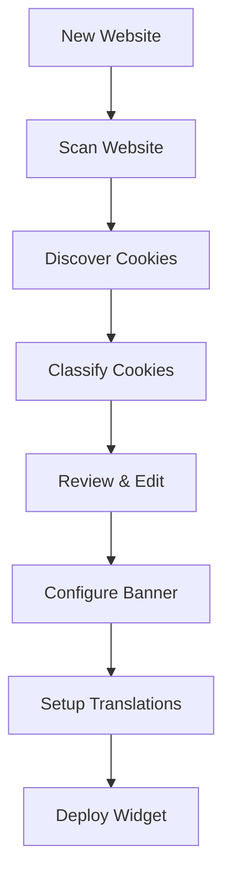
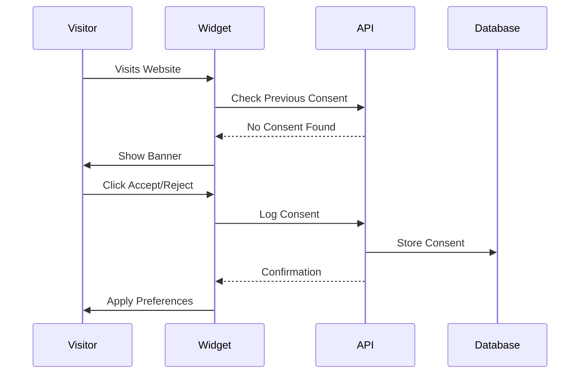

# Cookie Content Management System - How It Works

## Overview

The Cookie Content Management System is a comprehensive, production-ready solution for managing cookie consent across websites. It provides complete control over cookie tracking, consent collection, compliance checking, analytics, and multi-language support.

## System Architecture

```
┌──────────────────────────────────────────────────────────────┐
│                    Frontend (React/Next.js)                   │
│  ┌────────────┐  ┌─────────────┐  ┌──────────────────────┐  │
│  │  Cookie    │  │   Banner    │  │    Analytics         │  │
│  │  Scanner   │  │   Config    │  │    Dashboard         │  │
│  └────────────┘  └─────────────┘  └──────────────────────┘  │
│  ┌────────────┐  ┌─────────────┐  ┌──────────────────────┐  │
│  │ Compliance │  │ Translation │  │  Category            │  │
│  │  Checker   │  │  Manager    │  │  Management          │  │
│  └────────────┘  └─────────────┘  └──────────────────────┘  │
└────────────────────────────┬─────────────────────────────────┘
                             │
                ┌────────────┴────────────┐
                │    API Client Layer     │
                │  (lib/api-client.ts)    │
                └────────────┬────────────┘
                             │
┌────────────────────────────┴─────────────────────────────────┐
│                      Backend APIs                             │
│  ┌──────────┐  ┌──────────┐  ┌──────────┐  ┌──────────────┐ │
│  │ /banner  │  │/analytics│  │/compliance│  │/translations │ │
│  └──────────┘  └──────────┘  └──────────┘  └──────────────┘ │
│  ┌──────────┐  ┌──────────┐                                  │
│  │ /manage  │  │/categories│                                  │
│  └──────────┘  └──────────┘                                  │
└────────────────────────────┬─────────────────────────────────┘
                             │
                ┌────────────┴────────────┐
                │    Service Layer        │
                │ (CookieService, etc.)   │
                └────────────┬────────────┘
                             │
                    ┌────────┴────────┐
                    │   Supabase DB   │
                    │   PostgreSQL    │
                    └─────────────────┘
```

## Core Components

### 1. Cookie Scanner & Management

**Purpose:** Automatically discover and track cookies used on your website.

**How It Works:**
1. **Scanning Process:**
   - User enters a URL to scan
   - Backend crawls the website using headless browser
   - Detects all cookies (first-party and third-party)
   - Classifies cookies by category (necessary, analytics, advertising, etc.)
   - Extracts metadata (expiry, domain, purpose, provider)

2. **Cookie Storage:**
   ```typescript
   {
     id: "uuid",
     name: "_ga",
     domain: "example.com",
     category: "analytics",
     purpose: "Google Analytics tracking",
     expiry: "2 years",
     is_third_party: true,
     legal_basis: "consent",
     provider: "Google LLC",
     is_active: true
   }
   ```

3. **Management Actions:**
   - View all tracked cookies
   - Edit cookie metadata
   - Add custom cookies manually
   - Bulk import/export
   - Delete cookies
   - Filter by category, domain, status

**API Endpoints:**
- `GET /api/cookies/manage` - List cookies with filtering
- `POST /api/cookies/manage` - Add new cookie
- `PUT /api/cookies/manage` - Update cookie
- `DELETE /api/cookies/manage` - Remove cookie

---

### 2. Banner Configuration

**Purpose:** Customize the cookie consent banner appearance and behavior.

**How It Works:**
1. **Visual Customization:**
   - Choose layout (bar, box, modal, popup, floating)
   - Set position (top, bottom, corners, center)
   - Customize colors, fonts, borders
   - Design button styles
   - Set banner text and messaging

2. **Behavior Configuration:**
   - Auto-show on first visit
   - Show after delay
   - Respect Do Not Track
   - Block content until consent
   - Custom JavaScript/CSS

3. **Version History:**
   - Every configuration change creates a new version
   - Rollback to previous versions
   - Track changes over time

4. **Banner Object:**
   ```typescript
   {
     id: "uuid",
     name: "EU GDPR Banner",
     position: "bottom",
     layout: "bar",
     theme: {
       primaryColor: "#4F46E5",
       backgroundColor: "#FFFFFF",
       textColor: "#1F2937",
       fontSize: 14,
       borderRadius: 8
     },
     title: "We use cookies",
     message: "We use cookies to improve...",
     acceptButton: { text: "Accept All", ... },
     rejectButton: { text: "Reject All", ... },
     settingsButton: { text: "Settings", ... },
     is_active: true,
     is_default: true
   }
   ```

**API Endpoints:**
- `GET /api/cookies/banner` - List banners
- `POST /api/cookies/banner` - Create banner
- `PUT /api/cookies/banner` - Update banner
- `DELETE /api/cookies/banner` - Delete banner

---

### 3. Analytics Dashboard

**Purpose:** Track and analyze cookie consent metrics.

**How It Works:**
1. **Data Collection:**
   - Every consent action is logged:
     ```typescript
     {
       visitor_token: "unique-id",
       status: "accepted" | "rejected" | "partial",
       categories: ["analytics", "advertising"],
       device_info: { type: "Desktop", browser: "Chrome" },
       geo_location: { country: "US", city: "New York" },
       page_url: "https://example.com/",
       created_at: "2025-01-15T10:30:00Z"
     }
     ```

2. **Analytics Metrics:**
   - **Overview:**
     - Total consents
     - Acceptance rate
     - Rejection rate
     - Unique visitors
     - Return visitors

   - **Trends:**
     - Daily/weekly/monthly patterns
     - Growth rates
     - Comparison periods

   - **Breakdowns:**
     - By category (analytics, advertising, etc.)
     - By device (desktop, mobile, tablet)
     - By browser (Chrome, Safari, Firefox)
     - By geography (country, city)
     - By page URL

3. **Time Series Data:**
   - Consent actions over time
   - Acceptance vs rejection trends
   - Category preferences trends

4. **Export Functionality:**
   - Export to JSON
   - Export to CSV
   - Custom date ranges
   - Filtered exports

**API Endpoints:**
- `GET /api/cookies/analytics` - Get analytics data
- `POST /api/cookies/analytics` - Generate custom reports

---

### 4. Compliance Checker

**Purpose:** Automatically check compliance with privacy regulations (GDPR, DPDPA, CCPA, etc.).

**How It Works:**
1. **Compliance Checks:**
   - **Cookie Compliance:**
     - All cookies have purpose descriptions ✓
     - Legal basis documented ✓
     - Third-party cookie control ✓
     - Reasonable expiry periods ✓

   - **Consent Compliance:**
     - Consent collection active ✓
     - Granular consent options ✓
     - Healthy acceptance rates ✓
     - Consent refresh mechanism ✓

   - **Data Mapping Compliance:**
     - Processing activities documented ✓
     - Retention periods defined ✓
     - Legal basis documented ✓
     - Data processor agreements ✓

2. **Scoring System:**
   - Each check has a weight
   - Overall score 0-100
   - Status: excellent (90+), good (75-89), fair (60-74), needs_improvement (40-59), critical (<40)

3. **Issue Detection:**
   ```typescript
   {
     severity: "high" | "medium" | "low" | "critical",
     type: "missing_purpose",
     message: "5 cookies are missing purpose descriptions",
     affected_cookies: ["_ga", "_fbp", ...]
   }
   ```

4. **Recommendations:**
   ```typescript
   {
     type: "cookie_documentation",
     priority: "high",
     action: "Add purpose descriptions to all cookies",
     details: "Each cookie must have a clear purpose description"
   }
   ```

5. **Scheduled Checks:**
   - Run checks daily/weekly/monthly
   - Email notifications
   - Track compliance over time
   - Automated remediation suggestions

**API Endpoints:**
- `GET /api/cookies/compliance` - Get compliance status
- `POST /api/cookies/compliance` - Run compliance check
- `PUT /api/cookies/compliance` - Schedule checks
- `DELETE /api/cookies/compliance` - Delete schedule

---

### 5. Translation Manager

**Purpose:** Support multi-language cookie consent banners.

**How It Works:**
1. **Supported Languages:**
   - 16+ languages including:
   - English, Spanish, French, German, Italian
   - Portuguese, Dutch, Polish, Russian
   - Japanese, Chinese, Korean
   - Arabic (RTL), Hebrew (RTL)
   - Hindi, Bengali

2. **Translation Structure:**
   ```typescript
   {
     language_code: "es",
     language_name: "Español",
     is_rtl: false,
     translations: {
       banner: {
         title: "Usamos cookies",
         message: "Usamos cookies para mejorar...",
         accept_button: "Aceptar todo",
         reject_button: "Rechazar todo",
         settings_button: "Configuración"
       },
       settings_modal: {
         title: "Configuración de cookies",
         description: "Elija qué cookies desea aceptar...",
         save_button: "Guardar preferencias",
         ...
       },
       categories: {
         necessary: { name: "Necesarias", description: "..." },
         functional: { name: "Funcionales", description: "..." },
         analytics: { name: "Analíticas", description: "..." },
         advertising: { name: "Publicidad", description: "..." }
       },
       messages: {
         consent_saved: "Sus preferencias han sido guardadas",
         ...
       }
     }
   }
   ```

3. **Features:**
   - Default templates for all languages
   - Translation validation
   - Completeness checking (% complete)
   - Bulk import/export
   - RTL support for Arabic/Hebrew
   - Fallback to default language

4. **Language Detection:**
   - Automatically detect visitor's language
   - Show banner in their preferred language
   - Fallback to browser language
   - Manual language selection

**API Endpoints:**
- `GET /api/cookies/translations` - List translations
- `POST /api/cookies/translations` - Create/import translations
- `PUT /api/cookies/translations` - Update translation
- `DELETE /api/cookies/translations` - Delete translation

---

## Cookie Content Workflow

### 1. Initial Setup



### 2. Consent Collection Flow



### 3. Analytics Flow

```
Consent Logs → Aggregation → Time Series Data → Analytics Dashboard
     ↓              ↓              ↓                    ↓
  Device Info   Categories    Geography          Charts & Metrics
  Geo Location  Trends        Device/Browser      Export Reports
  Page URL      Rates         Top Pages          Custom Filters
```

### 4. Compliance Flow

```
1. Schedule Check (daily/weekly/monthly)
2. Run Compliance Checks:
   - Cookie checks (purpose, legal basis, expiry)
   - Consent checks (granularity, rates, refresh)
   - Data mapping checks (retention, purpose, processors)
3. Calculate Score (0-100)
4. Generate Issues & Recommendations
5. Send Email Notification
6. Store Results for History
```

---

## Database Schema

### Tables Required

```sql
-- Cookies
CREATE TABLE cookies (
  id UUID PRIMARY KEY,
  user_id UUID REFERENCES users(id),
  name VARCHAR(255),
  domain VARCHAR(255),
  category VARCHAR(50),
  purpose TEXT,
  description TEXT,
  provider VARCHAR(255),
  provider_url VARCHAR(500),
  expiry VARCHAR(100),
  expiry_days INTEGER,
  type VARCHAR(50),
  is_third_party BOOLEAN,
  data_collected TEXT[],
  legal_basis VARCHAR(100),
  is_active BOOLEAN DEFAULT true,
  created_at TIMESTAMP DEFAULT NOW(),
  updated_at TIMESTAMP DEFAULT NOW()
);

-- Banner Configurations
CREATE TABLE banner_configs (
  id UUID PRIMARY KEY,
  user_id UUID REFERENCES users(id),
  name VARCHAR(255),
  description TEXT,
  position VARCHAR(50),
  layout VARCHAR(50),
  theme JSONB,
  title TEXT,
  message TEXT,
  privacy_policy_url VARCHAR(500),
  accept_button JSONB,
  reject_button JSONB,
  settings_button JSONB,
  show_reject_button BOOLEAN,
  show_settings_button BOOLEAN,
  auto_show BOOLEAN,
  show_after_delay INTEGER,
  respect_dnt BOOLEAN,
  block_content BOOLEAN,
  custom_css TEXT,
  custom_js TEXT,
  z_index INTEGER,
  is_active BOOLEAN DEFAULT true,
  is_default BOOLEAN DEFAULT false,
  created_at TIMESTAMP DEFAULT NOW(),
  updated_at TIMESTAMP DEFAULT NOW()
);

-- Banner Versions
CREATE TABLE banner_versions (
  id UUID PRIMARY KEY,
  banner_id UUID REFERENCES banner_configs(id) ON DELETE CASCADE,
  user_id UUID REFERENCES users(id),
  config JSONB,
  version INTEGER,
  change_description TEXT,
  created_at TIMESTAMP DEFAULT NOW()
);

-- Consent Logs
CREATE TABLE consent_logs (
  id UUID PRIMARY KEY,
  user_id UUID REFERENCES users(id),
  consent_id VARCHAR(255),
  visitor_token VARCHAR(255),
  consent_type VARCHAR(50),
  status VARCHAR(50),
  categories TEXT[],
  cookies_accepted TEXT[],
  cookies_rejected TEXT[],
  device_info JSONB,
  geo_location JSONB,
  ip_address VARCHAR(100),
  user_agent TEXT,
  referrer VARCHAR(500),
  page_url VARCHAR(500),
  language VARCHAR(10),
  browser_fingerprint VARCHAR(255),
  consent_method VARCHAR(50),
  widget_version VARCHAR(50),
  tcf_string TEXT,
  created_at TIMESTAMP DEFAULT NOW()
);

-- Consent Analytics (Aggregated)
CREATE TABLE consent_analytics (
  id UUID PRIMARY KEY,
  user_id UUID REFERENCES users(id),
  date DATE,
  accepted INTEGER DEFAULT 0,
  rejected INTEGER DEFAULT 0,
  partial INTEGER DEFAULT 0,
  total INTEGER DEFAULT 0,
  unique_visitors INTEGER DEFAULT 0,
  return_visitors INTEGER DEFAULT 0,
  created_at TIMESTAMP DEFAULT NOW()
);

-- Compliance Checks
CREATE TABLE compliance_checks (
  id UUID PRIMARY KEY,
  user_id UUID REFERENCES users(id),
  regulations TEXT[],
  overall_score INTEGER,
  status VARCHAR(50),
  issues JSONB,
  recommendations JSONB,
  checks_performed JSONB,
  details JSONB,
  created_at TIMESTAMP DEFAULT NOW()
);

-- Compliance Schedules
CREATE TABLE compliance_schedules (
  id UUID PRIMARY KEY,
  user_id UUID REFERENCES users(id),
  frequency VARCHAR(50),
  day_of_week INTEGER,
  day_of_month INTEGER,
  time VARCHAR(10),
  regulations TEXT[],
  notify_email VARCHAR(255),
  is_active BOOLEAN DEFAULT true,
  created_at TIMESTAMP DEFAULT NOW(),
  updated_at TIMESTAMP DEFAULT NOW()
);

-- Widget Translations
CREATE TABLE widget_translations (
  id UUID PRIMARY KEY,
  user_id UUID REFERENCES users(id),
  language_code VARCHAR(10),
  language_name VARCHAR(100),
  is_rtl BOOLEAN DEFAULT false,
  is_default BOOLEAN DEFAULT false,
  translations JSONB,
  is_active BOOLEAN DEFAULT true,
  is_complete BOOLEAN DEFAULT false,
  completion_percentage INTEGER DEFAULT 0,
  created_at TIMESTAMP DEFAULT NOW(),
  updated_at TIMESTAMP DEFAULT NOW(),
  UNIQUE(user_id, language_code)
);

-- Cookie Categories
CREATE TABLE cookie_categories (
  id UUID PRIMARY KEY,
  user_id UUID REFERENCES users(id),
  category_id VARCHAR(100),
  name VARCHAR(255),
  description TEXT,
  is_required BOOLEAN DEFAULT false,
  display_order INTEGER DEFAULT 0,
  icon VARCHAR(100),
  color VARCHAR(50),
  is_active BOOLEAN DEFAULT true,
  created_at TIMESTAMP DEFAULT NOW(),
  updated_at TIMESTAMP DEFAULT NOW()
);
```

---

## Frontend Integration

### Cookie Management Page Structure

```
/dashboard/cookies
  ├── Overview Tab
  │   ├── Quick Stats (total cookies, categories, compliance score)
  │   ├── Recent Activities
  │   └── Quick Actions
  │
  ├── Scanner Tab
  │   ├── Scan Input (URL, depth)
  │   ├── Scan Results
  │   ├── Cookie List with Edit/Delete
  │   └── Bulk Actions
  │
  ├── Banner Config Tab
  │   ├── Visual Editor
  │   ├── Theme Customization
  │   ├── Position & Layout
  │   ├── Button Styles
  │   └── Live Preview
  │
  ├── Analytics Tab
  │   ├── Date Range Selector
  │   ├── Metrics Cards
  │   ├── Charts (trends, devices, geography)
  │   ├── Export Button
  │   └── Custom Reports
  │
  ├── Compliance Tab
  │   ├── Current Score
  │   ├── Run Check Button
  │   ├── Issues List
  │   ├── Recommendations
  │   ├── Compliance History
  │   └── Schedule Settings
  │
  └── Translations Tab
      ├── Language Selector
      ├── Translation Editor
      ├── Completeness Indicator
      ├── Import/Export
      └── Preview
```

---

## Widget Integration

### How the Widget Works on User's Website

1. **Installation:**
   ```html
   <!-- Add to website <head> -->
   <script src="https://cdn.consently.com/widget.js" 
           data-api-key="your-api-key"
           async></script>
   ```

2. **Widget Initialization:**
   ```javascript
   // Widget loads configuration from API
   const config = await fetch('/api/cookies/banner?active=true')
   const translations = await fetch('/api/cookies/translations?language=en')
   
   // Initialize banner with config
   ConsentlyWidget.init({
     config: config,
     translations: translations,
     onConsent: (consent) => {
       // Log consent to API
       fetch('/api/cookies/consent-log', {
         method: 'POST',
         body: JSON.stringify(consent)
       })
     }
   })
   ```

3. **Consent Flow:**
   - Widget checks for existing consent
   - Shows banner if no consent found
   - Collects visitor's choice
   - Sends to API for logging
   - Applies cookie preferences
   - Triggers analytics event

---

## Best Practices

1. **Cookie Management:**
   - Scan regularly (monthly)
   - Keep cookie descriptions updated
   - Document all new cookies immediately
   - Review third-party cookies

2. **Banner Configuration:**
   - Use clear, simple language
   - Make rejection as easy as acceptance
   - Provide granular choices
   - Test on all devices

3. **Analytics:**
   - Monitor acceptance rates
   - Track compliance trends
   - Export reports regularly
   - Set up alerts for low acceptance

4. **Compliance:**
   - Run checks weekly
   - Address critical issues immediately
   - Keep documentation current
   - Schedule regular reviews

5. **Translations:**
   - Use native speakers for translations
   - Test RTL languages carefully
   - Keep translations synchronized
   - Update all languages together

---

## Future Enhancements

1. **AI-Powered Features:**
   - Auto-categorize cookies
   - Suggest optimal banner designs
   - Predict acceptance rates
   - Auto-translate with AI

2. **Advanced Analytics:**
   - Funnel analysis
   - A/B testing
   - Heatmaps
   - Session recordings

3. **Enhanced Compliance:**
   - Auto-remediation
   - Legal document generation
   - Regulatory change alerts
   - Compliance scoring trends

4. **Integration:**
   - CMS plugins (WordPress, Shopify)
   - CDN integration
   - Tag manager support
   - Analytics platform connectors

---

## Support & Resources

- API Documentation: `/COOKIE_APIS_DOCUMENTATION.md`
- Integration Guide: Coming soon
- Video Tutorials: Coming soon
- Support: support@consently.com
